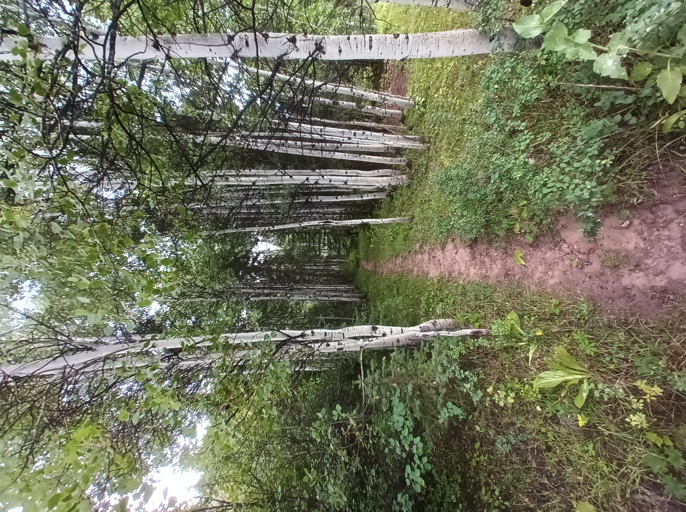
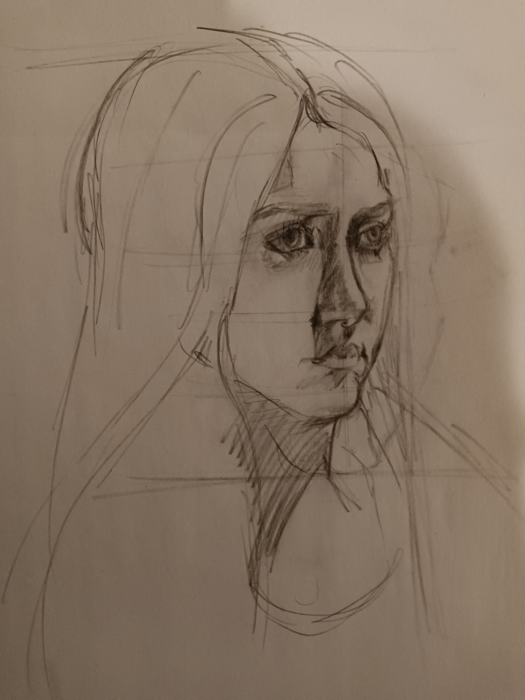

```{r echo=FALSE,out.width = "50%",fig.align='center'}
knitr::include_graphics("./media/state_capital_photo.jpg")
```

## [Resume](https://casgap.github.io/about-me/Resume.pdf) | [Cover Letter](https://casgap.github.io/about-me/Cover_Letter.pdf)

___


## Hobbies

### Getting outside, hiking

```{r echo=FALSE,out.width = "50%"}
knitr::include_graphics("./media/snowy_trees.jpg")


```

### Working with kids, and drawing
```{r echo=FALSE,out.width = "50%"}
knitr::include_graphics("./media/student_drawing.jpg")


```