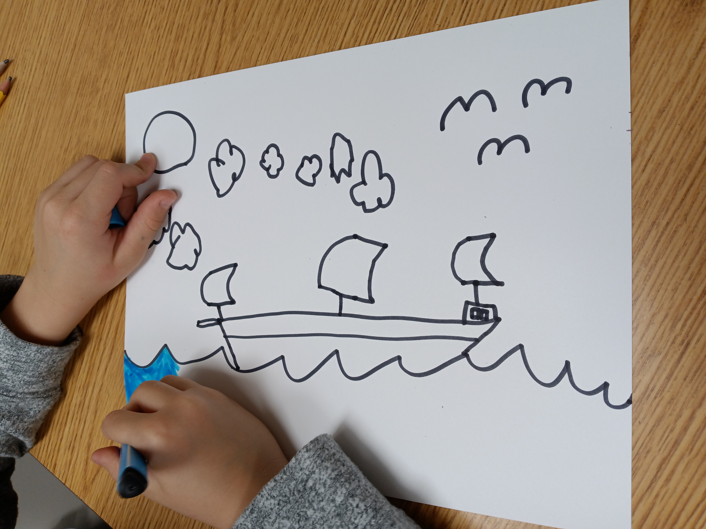
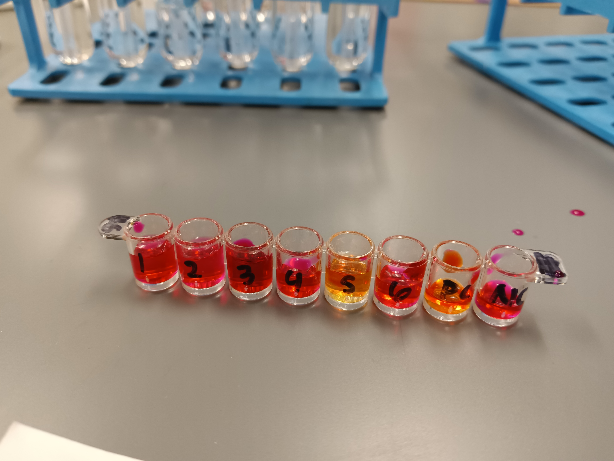

```{r echo=FALSE,out.width = "50%",fig.align='center'}
knitr::include_graphics("./media/state_capital_photo.jpg")
```

## [Resume](https://casgap.github.io/about-me/Resume.pdf)

___

### I enjoy getting outdoors and hiking
```{r echo=FALSE,out.width = "50%"}
knitr::include_graphics("./media/snowy_mountains.jpg")
```

```{r echo=FALSE,out.width = "50%"}
knitr::include_graphics("./media/wave_az.jpg")
```

```{r echo=FALSE,out.width = "50%"}
knitr::include_graphics("./media/timp_view.jpg")
```

### Helping others develop capacities and talents
```{r echo=FALSE,out.width = "50%"}

```

### Learning and discovery
```{r echo=FALSE,out.width = "50%"}
knitr::include_graphics("./media/crystal_chem.jpg")
```

```{r echo=FALSE,out.width = "50%"}

```